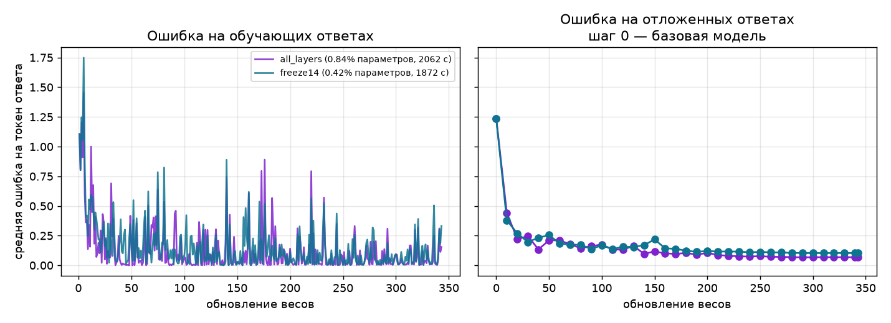

# Русские команды личного планировщика

**ДЗ5: обучение LoRA-адаптера к Qwen3-0.6B.** Модель классифицирует
русские команды о календаре, списках и будильниках. Выполнены два полных
варианта: добавочные матрицы во всех 28 слоях и только в последних 14.

## Результат

| Измерение | Все 28 слоёв | Только последние 14 |
|---|---:|---:|
| Обучаемые параметры | 5,046,272 | 2,523,136 |
| Доля параметров с адаптером | 0.84% | 0.42% |
| Шаги обновления | 343 | 343 |
| Ошибка до обучения | 1.236143 | 1.236143 |
| Ошибка после обучения | 0.067542 | 0.102787 |
| Обучение, без оценки | 2062.4 с | 1872.1 с |
| Начальная и последующие оценки | 2040.9 с | 1865.9 с |
| Обучение вместе с оценкой | 4103.2 с | 3738.0 с |
| Наблюдаемая память MPS | 2347.8 МиБ | 2339.9 МиБ |
| Папка адаптера и токенизатор | 30.20 МиБ | 20.55 МиБ |

Обучение использовало **2743 примера**, оценка —
**352 примера**. Одна полная эпоха, 343 обновления,
`max_steps: null`. Ошибка проверяется до обучения и каждые десять шагов.
Пять демонстрационных команд: база **1/5**, адаптер
**5/5** точных меток; это не оценка точности на всём наборе.

[Кривые](docs/curves.png) · [Ответы до/после](docs/compare.md)
· [Пять дефектов](docs/defects.md) · [Обзор и условия измерений](docs/overview.md)



## Воспроизведение

Нужны Git, `uv`, Python 3.12 и достаточно памяти для Qwen3-0.6B.
Из корня проекта:

```sh
make install
make fetch-data
make data       # подготовка исходных и числовых данных
make train      # оба полных запуска и график
make compare    # пять одинаковых команд для базы и адаптера
make check      # 9 исходных проверок преподавателя
make test       # 40 дополнительных тестов
```

Настройки — в `params.yaml`. LoRA означает низкоранговую адаптацию:
обучение небольших добавочных матриц при неизменных базовых весах. `device: auto` выбирает CUDA, MPS или CPU;
для CPU нужна точность `float32`, полный прогон может быть долгим.
На первом запуске библиотека загружает базовую модель с Hugging Face.
При заполненном кэше можно задать `HF_HUB_OFFLINE=1`.

DVC сравнивает код, входы и настройки с `dvc.lock`; неизменившиеся стадии
не запускаются повторно. Для принудительного нового обучения:
`uv run --locked dvc repro -f train_all train_freeze curves`.
`make clean` удаляет результаты обучения; `make distclean` ещё и окружение.

## Проверка

Все девять проверок прошли. Неизменённый `tests/check.sh`: **06a02208c1f0**.
[Протокол](docs/results/hw05-check.txt). Проверка требует готовые результаты,
загружает копию адаптера без сети и обучает дважды по три шага.
Для загрузки без сети базовые веса должны уже быть в кэше.

## Файлы

| Файл или папка | Назначение |
|---|---|
| `src/train.py` | Оценка, обновление добавочных матриц, сохранение |
| `src/runtime.py` | Устройство, случайность, измерение памяти |
| `src/data.py`, `src/collate.py` | Чтение последовательностей и сборка батчей |
| `src/compare.py`, `src/prompt.py` | Одинаковая подготовка запросов и ответы |
| `src/plot.py` | График двух вариантов |
| `models/adapter_*/` | Локальные матрицы, настройки, токенизатор и шаблон |
| `metrics/train_*.json` | Локальные кривые и подробные измерения |
| `docs/` | Отчёты и графики для сдачи |
| `params.yaml`, `dvc.yaml`, `dvc.lock`, `uv.lock` | Настройки, зависимости и версии |

## Данные и сохранённые этапы

Источник — русский [MASSIVE 1.0](https://github.com/alexa/massive), Amazon,
[CC BY 4.0](docs/MASSIVE-LICENSE.txt), основанный на SLURP.
[Паспорт](docs/datasheet.md) описывает отбор и ограничения.
Согласование темы преподавателем не зафиксировано.

Веса, данные, метрики и видео исключены из Git. Хранилище DVC находится
локально в `../MLOps-dvc-store`; на другом компьютере оно недоступно.
Повторить работу можно командами выше или восстановить артефакты через
`uv run --locked dvc pull` при доступе к этому хранилищу.

Сохранены [подготовка последовательностей](docs/tokenize_report.md),
[разбор ДЗ4](docs/hw04-defects.md), [подготовка данных](docs/hw03-defects.md),
[отчёт о модели](docs/anatomy.md), [железо](docs/hardware.md),
команды `make check-hw1`, `make check-hw2`, `make check-hw3`, `make check-hw4`
и метки данных `hw03-v1`, `hw03-v2`.
Старая проверка `check-hw3` переключает версии данных и пересчитывает
все зависимые стадии; запускать её удобнее в отдельной копии на метке
`hw03-v2`, чтобы не повторять текущее обучение.
Лекции, заметки, окружение, образец голоса и рабочие записи остаются локально.
