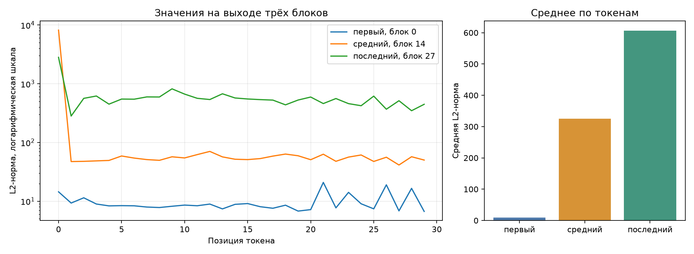

# ДЗ2. Анатомия Qwen/Qwen3-0.6B

Задание: исправить заготовку, посчитать параметры, снять значения внутри модели,
проверить две конфигурации LoRA и сравнить память трёх режимов.
Выполнено командой `make inspect`; исходные числа — в [report.json](report.json),
ручная арифметика с формулами — в [anatomy-worksheet.xlsx](anatomy-worksheet.xlsx).

Время начала разбора: 2026-09-13T22:06:18.974737+00:00.

## 1. Устройство модели

| Поле | Значение |
|---|---:|
| `num_hidden_layers` | 28 |
| `hidden_size` | 1024 |
| `intermediate_size` | 3072 |
| `num_attention_heads` | 16 |
| `num_key_value_heads` | 8 |
| `head_dim` | 128 |
| `vocab_size` | 151936 |
| `tie_word_embeddings` | True |

Один токен представлен вектором hidden_size. В каждом блоке есть механизм
внимания и MLP — преобразование через промежуточное пространство intermediate_size.
У этой модели 16 голов запроса и 8 голов ключей/значений.
Несколько голов запроса используют общие ключи и значения — такое устройство называют GQA.

## 2. Условия замера

| Условие | Значение |
|---|---|
| платформа | macOS-26.6.2-arm64-arm-64bit |
| устройство | `mps` |
| модель | `Qwen/Qwen3-0.6B` |
| dtype | `bfloat16` |
| seq_len × batch_size | 256 × 1 |
| прогонов на режим | 1; каждый в новом процессе |
| память ускорителя | `torch.mps.driver_allocated_memory` |
| память процесса | `ru_maxrss` |
| интервал опроса | 0.01 с, плюс границы стадий |
| кэш ключей и значений | `use_cache=False` во всех режимах |
| шаг обучения | forward + backward + AdamW.step; foreach=False |
| Python | 3.12.12 |
| torch | 2.14.0 |
| transformers | 5.16.1 |
| peft | 0.20.0 |

Вход — случайные номера токенов с фиксированным seed=42. Собственный датасет здесь
не используется; один шаг проверяет расход памяти, а не качество обучения.

На MPS считается максимум наблюдений driver_allocated_memory. Это память драйвера,
включая резерв аллокатора и выделения Metal/MPS, а не только живые тензоры.
Очень короткий всплеск между опросами может быть пропущен. RSS сохранён отдельно:
это память процесса и другая метрика. На CUDA используется встроенный счётчик пика.

## 3. Параметры по частям модели

| Группа | Тензоров | Размеры | Собственных параметров | Доля | Общих параметров |
|---|---:|---|---:|---:|---:|
| `embed` | 1 | 151936×1024 | 155 582 464 | 26.102% | 0 |
| `q_proj` | 28 | 2048×1024 | 58 720 256 | 9.852% | 0 |
| `k_proj` | 28 | 1024×1024 | 29 360 128 | 4.926% | 0 |
| `v_proj` | 28 | 1024×1024 | 29 360 128 | 4.926% | 0 |
| `o_proj` | 28 | 1024×2048 | 58 720 256 | 9.852% | 0 |
| `gate_proj` | 28 | 3072×1024 | 88 080 384 | 14.777% | 0 |
| `up_proj` | 28 | 3072×1024 | 88 080 384 | 14.777% | 0 |
| `down_proj` | 28 | 1024×3072 | 88 080 384 | 14.777% | 0 |
| `norm` | 113 | 128, 1024 | 65 536 | 0.011% | 0 |
| `lm_head` | 1 | 151936×1024 | 0 | 0.000% | 155 582 464 |
| **Итого** | | | **596 049 920** | **100%** | |

Прямой подсчёт: **596 049 920**. Разница: **0**.
Имена и размеры всех отдельных тензоров, их доли и владельцы общих весов находятся
в `report.json → parameter_rows`.

`lm_head` повторно использует 155 582 464 параметров входной таблицы embed_tokens.
Поэтому его собственный вклад равен нулю. Назначений два, физический набор чисел один.
Нормировки включают векторы разных размеров: 128, 1024; это учтено отдельно в таблице Excel.
`k_proj` содержит 0.50 от числа параметров `q_proj` из-за меньшего числа KV-голов.
MLP содержит 264 241 152 параметров:
три большие матрицы перехода между hidden_size и intermediate_size.

## 4. Значения внутри модели

Запрос: Объясни, что такое MLOps, в трёх предложениях. После шаблона диалога — 30 токенов.
Для каждой позиции измерена длина вектора выхода блока, то есть L2-норма.



| Блок | Индекс с нуля | Средняя норма | Максимум | Позиция максимума |
|---|---:|---:|---:|---:|
| первый | 0 | 9.68 | 20.85 | 21 |
| средний | 14 | 325.49 | 8189.66 | 0 |
| последний | 27 | 606.88 | 2815.10 | 0 |

Большая норма означает большой масштаб промежуточных чисел, а не высокое качество ответа.
Один такой график не доказывает распределение внимания: для этого пришлось бы отдельно
измерять сами веса внимания. Остаточные связи складывают выход блока с входом,
но сами по себе не гарантируют монотонного роста нормы на каждом токене.
Функции наблюдения снимаются в finally; повторный прогон не накапливает хуки.

## 5. Дополнительные параметры LoRA

Исходная матрица остаётся замороженной; обучаются A формы (r, in) и B формы (out, r).
На выбранный линейный слой приходится `r × (in + out)` параметров.

| Конфигурация | По формуле | Библиотека peft | Разница | Доля от базовой модели |
|---|---:|---:|---:|---:|
| r=8, q_proj+v_proj | 1 146 880 | 1 146 880 | 0 | 0.192% |
| r=16, все линейные | 10 092 544 | 10 092 544 | 0 | 1.693% |

Для r=16 выбраны q/k/v/o/gate/up/down; выходной lm_head не включён.
Процент здесь от базовой модели; peft может печатать процент от модели вместе с добавками.

## 6. Память обычного запуска и обучения

Единицы — МиБ (1024² байт); в исходном шаблоне они подписаны МБ.
Память измеряется после загрузки весов и до освобождения результатов шага.
Время включает загрузку модели. Это не сравнение скорости обучения.

| Режим | Пик драйвера, МиБ | Пик RSS, МиБ | К обычному запуску | Время, с | PID | Опросов |
|---|---:|---:|---:|---:|---:|---:|
| Обычный запуск | 2197.6 | 1846.1 | 1.00 | 6.6 | 83014 | 73 |
| Полное дообучение | 6083.6 | 2030.6 | 2.77 | 9.4 | 83057 | 292 |
| LoRA r=8, q/v | 3579.6 | 2030.3 | 1.63 | 7.4 | 83063 | 147 |

Уникальные базовые веса занимают **1136.88 МиБ** по numel × element_size.
В полном обучении градиенты занимают 1136.88 МиБ, состояния AdamW — 2273.75 МиБ.
Для LoRA это 4.38 и 8.75 МиБ соответственно.
Эти размеры измерены по тензорам; итоговый пик также включает промежуточные значения,
буферы вычислений и резерв драйвера. Поэтому он не обязан совпасть с суммой одних весов и градиентов.
В этом запуске полное обучение требует в 1.70 раза больше памяти, чем LoRA.
LoRA экономит градиенты и состояния оптимизатора, но для обратного прохода всё равно нужны активации.

## 7. Исправления заготовки и проверка

| Дефект | Проявление | Исправление и наблюдаемый результат |
|---|---|---|
| Общие веса считались дважды | Сумма была бы завышена на 155 582 464 | parameter_rows помечает повторный Parameter; сумма 596 049 920, разница с прямым подсчётом 0 |
| Хуки не снимались | Каждый вызов добавлял ещё три обработчика | Дескрипторы снимаются в finally; make check проверяет 0 после каждого из двух прогонов, отдельный тест проверяет исключение |
| Вместо пика снимался остаток в конце | Промежуточные выделения могли быть пропущены | Опрос каждые 0.01 с и на границах стадий; число опросов и история максимумов сохранены в report.json |
| На ускорителе использовался RSS | Измерялась другая величина | Основная метрика torch.mps.driver_allocated_memory; RSS отдельной колонкой |

Дополнительно каждый режим перенесён в отдельный дочерний процесс. Конфигурация передаётся
ему через стандартный ввод; разные PID приведены выше. Шаблон диалога не получает
повторные служебные токены. Настройки градиентов после временной установки LoRA восстанавливаются.

## 8. Как проверить

```sh
make install
make inspect
make check
make test
make check-hw1
```

`make check` выполняет семь проверок ДЗ2, включая новые измерения памяти.
Логи успешного прогона сохраняются в docs/results/hw02-check.txt.
Команды generate и bench, а также отчёт hardware.md относятся к ДЗ1 и сохранены.
Тема будущего датасета пока не согласована; здесь она не требуется.

Источники: [память MPS](https://docs.pytorch.org/docs/2.14/generated/torch.mps.driver_allocated_memory.html),
[параметры LoRA](https://huggingface.co/docs/peft/package_reference/lora).
